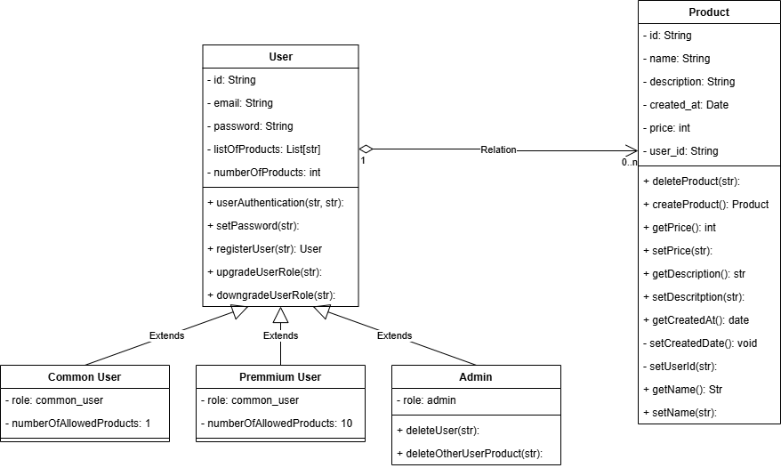

# api-rest-javascript

A RESTful API built with **Node.js** and **Express.js** as a learning project, focused on exploring backend development concepts such as routing, middleware, authentication, and error handling.

## Overview

This API is designed to support a catalog system where users can manage product listings. It includes role-based access control and integrates with a NoSQL database for flexibility in product data structure.

### Key Features

- Users can **register**, **edit**, and **delete** their own products.
- Role-based access: different permissions for common, premium, and admin users.
- Products can represent physical items, digital services, or other business offerings.
- Built to support a **frontend consumer**.
- Optimized for small-scale use (~100 users).
- User authentication and authorization implemented.

## Product Model

The product entity is designed to be **adaptable** to various business needs. It can represent tangible goods, services, or abstract offerings. To accommodate flexible schemas and future modifications, the project uses **MongoDB** as the database solution.

## User Roles

- **Common User**: Can register **1** product.
- **Premium User**: Can register up to **10** products.
- **Admin**: Full control over all products and user accounts (create, update, delete).

## Technologies Used

- **Node.js**
- **Express.js**
- **MongoDB**

## Class diagram

